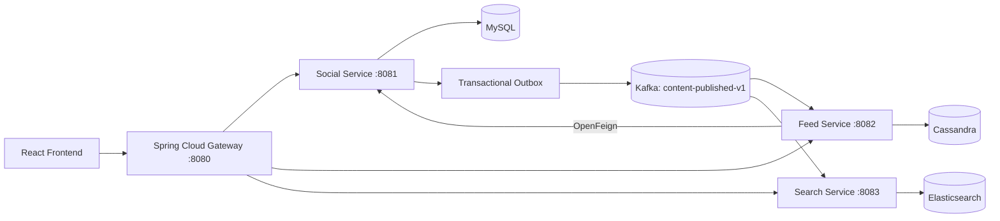

# Text Social

Text Social is a text-only social-media platform implemented as an event-driven microservices system. It provides authentication, posts, threaded replies, follows, likes, personalized feeds, and full-text search.

The project demonstrates service ownership, asynchronous event propagation, polyglot persistence, API gateway routing, and independently rebuildable read models.

## Architecture



The browser communicates only with the Gateway. Social Service owns authoritative transactional data in MySQL. Feed Service and Search Service maintain independently rebuildable read models in Cassandra and Elasticsearch.

## Services

### Social Service

Owns users, authentication, relationships, posts, replies, likes, and the outbox. It uses MySQL, Spring Data JPA, Flyway migrations, Spring Security, and JWT access tokens.

### Feed Service

Consumes published-content events and builds timeline projections in Cassandra. It uses a hybrid feed algorithm: ordinary authors use fan-out-on-write, while celebrity authors are merged into a timeline during reads. Feed hydration uses OpenFeign to call Social Service.

### Search Service

Consumes the same content events as Feed Service and indexes them in Elasticsearch. Search is eventually consistent and uses the content ID as the document ID for idempotent updates.

### Gateway

Spring Cloud Gateway is the single HTTP entry point. It routes API paths to backend services and provides the browser-facing CORS and JWT security boundary.

### Event Contracts

The `event-contracts` module contains versioned Kafka wire types shared by producers and consumers. The current event is `ContentPublishedV1`.

## Event and Pub/Sub flow

When a post is created:

1. Social Service saves the post and an outbox record in one MySQL transaction.
2. A scheduled publisher reads unpublished outbox records.
3. The publisher sends `ContentPublishedV1` to Kafka topic `content-published-v1`.
4. Feed Service consumes the event and writes Cassandra feed projections.
5. Search Service consumes the same event independently and writes an Elasticsearch document.

Feed Service and Search Service use different Kafka consumer groups, so both receive every relevant event. This is an at-least-once delivery model with idempotent consumers. A crash after Kafka acknowledgement but before the outbox row is marked published can produce a duplicate; stable content IDs make reprocessing safe.

## Data ownership and consistency

- MySQL is the source of truth for identity and social interactions.
- Cassandra stores query-oriented timeline projections, not relational joins.
- Elasticsearch stores a searchable content projection.
- Writes to Social Service are strongly consistent within MySQL transactions.
- Feeds and search are eventually consistent and may update shortly after a post succeeds.
- If a read model is lost, it can be rebuilt by replaying retained Kafka events.

## Spring Cloud usage

This project uses Spring Cloud for:

- **Spring Cloud Gateway** — edge routing, centralized entry point, and request filtering.
- **Spring Cloud OpenFeign** — declarative HTTP communication from Feed Service to Social Service.
- **Spring Cloud BOM** — compatible dependency management in the root Maven POM.

Service discovery and Spring Cloud Config are intentionally not included. Local service URLs are supplied through environment variables and Docker Compose networking.

## Features

- User registration and login with JWT authentication
- User profiles and follow relationships
- Text posts with nested threaded replies
- Idempotent likes and follows
- Cursor-based pagination
- Personalized home timelines
- Hybrid celebrity fan-out strategy
- Full-text content search
- Transactional outbox publishing
- Idempotent Kafka consumers
- Gateway routing and CORS configuration
- Health endpoints through Spring Boot Actuator
- React frontend
- Docker Compose development environment
- JMeter load-test configuration

## Technology stack

- Java 21
- Spring Boot 3.5
- Spring Cloud 2025
- Spring MVC and WebFlux
- Spring Data JPA and Cassandra
- Spring Kafka
- Spring Cloud Gateway
- Spring Cloud OpenFeign
- Spring Security and JWT
- MySQL 8.4
- Apache Kafka 3.9
- Cassandra 5
- Elasticsearch 8
- React, Vite, and Nginx
- Docker Compose

## Running with Docker Compose

Prerequisites: Docker Desktop with approximately 4 GB of available memory.

```powershell
docker compose up --build -d
docker compose ps
```

Open the application at `http://localhost:8915`.

The local Compose ports are:

| Component | URL or port |
|---|---|
| Frontend | http://localhost:8915 |
| Gateway | http://localhost:8911 |
| Social Service | http://localhost:8912 |
| Feed Service | http://localhost:8913 |
| Search Service | http://localhost:8914 |
| MySQL | localhost:8916 |
| Kafka | localhost:8917 |
| Cassandra | localhost:8918 |
| Elasticsearch | http://localhost:8919 |

Follow application logs with:

```powershell
docker compose logs -f gateway social-service feed-service search-service
```

Stop the stack with:

```powershell
docker compose down
```

Named volumes are preserved by `down`. Use `docker compose down -v` only when local database data should be removed.

## Running backend services locally

Start infrastructure first:

```powershell
.\\scripts\\start-infra.ps1
mvn test
.\\scripts\\build.ps1
```

Then start the services from the repository root:

```powershell
mvn -pl social-service spring-boot:run
mvn -pl feed-service spring-boot:run
mvn -pl search-service spring-boot:run
mvn -pl gateway spring-boot:run
```

Start the frontend in a separate terminal:

```powershell
Set-Location frontend
npm.cmd install
npm.cmd run dev
```

For local Spring Boot execution, the Gateway listens on port `8080`; the backend services use ports `8081`–`8083`. Environment variables can override infrastructure and service URLs.

## API examples

The file [`requests.http`](requests.http) contains ready-to-run examples for registration, login, posting, replies, likes, follows, feeds, and search.

Typical API calls use the Gateway:

```http
POST http://localhost:8911/api/auth/login
Content-Type: application/json

{"username":"demo_user","password":"password123"}
```

```http
POST http://localhost:8911/api/posts
Authorization: Bearer YOUR_TOKEN
Content-Type: application/json

{"text":"Hello from Text Social"}
```

## Verification

```powershell
mvn test
Set-Location frontend
npm.cmd run test
npm.cmd run build
```

## Security note

The default JWT secret and internal API key are development values only. Set secure values through environment variables before using the system outside a local environment.

