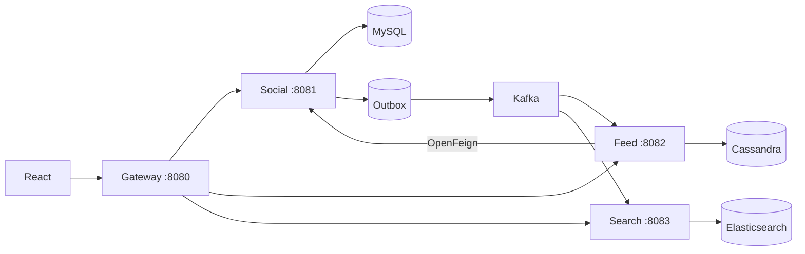

# Text Social

A deliberately small, text-only social network for learning Spring MVC and distributed-system design. The repository is a **boilerplate, not a completed solution**: it builds successfully, exposes the final HTTP contracts, and marks your implementation work with `TODO(LAB-n)`.

## Architecture



Read [the system-design notes](docs/SYSTEM_DESIGN.md), then work through [the labs](docs/LABS.md) in order. API calls are ready in [requests.http](requests.http).

## Prerequisites

- Java 21 and Maven 3.9+
- Node 20.19+ (Node 24 is already installed on this machine)
- Docker Desktop with at least roughly 4 GB available to containers
- Apache JMeter 5.6.3 for Lab 8

The local HMAC JWT secret and internal API key are intentionally shared development secrets. Never copy this security arrangement into production.

## First run on Windows

### Run everything with Docker Compose

Stop any locally running Java or Vite processes using ports 8080-8083 or 5173, then run from the repository root:

```powershell
docker compose up --build -d
docker compose ps
```

Open `http://localhost:5173`. Follow logs with `docker compose logs -f gateway social-service feed-service search-service` and stop the stack with `docker compose down`. Named database volumes are preserved by `down`; use `down -v` only when you intentionally want to erase local data.

1. Start Docker Desktop.
2. Start the databases and broker:

   ```powershell
   .\scripts\start-infra.ps1
   ```

3. Verify and install backend modules once. This step is required because each service is started independently and depends on the shared `event-contracts` JAR:

   ```powershell
   mvn test
   .\scripts\build.ps1
   ```

4. In four terminals, start the services. MySQL defaults to host port `3307` in this project:

   ```powershell
   mvn -pl social-service spring-boot:run
   mvn -pl feed-service spring-boot:run
   mvn -pl search-service spring-boot:run
   mvn -pl gateway spring-boot:run
   ```

5. Start React in another terminal. Use `npm.cmd` because this machine's PowerShell policy blocks `npm.ps1`:

   ```powershell
   Set-Location frontend
   npm.cmd install
   npm.cmd run dev
   ```

6. Open `http://localhost:5173`. Before completing a lab, its endpoint intentionally returns `501 LAB_NOT_IMPLEMENTED`.

Kafka listeners default to off so an unfinished consumer cannot surprise you. Enable them in Labs 5–6 with `KAFKA_LISTENER_ENABLED=true`.

## Project map

- `social-service`: users, authentication, relationships, content, likes, MySQL, and outbox ownership.
- `feed-service`: Cassandra read models and hybrid celebrity timeline algorithm.
- `search-service`: Elasticsearch projection populated from Kafka.
- `gateway`: the only browser entry point and first JWT/CORS boundary.
- `event-contracts`: only versioned Kafka wire types; no domain entities or service logic.
- `frontend`: plain React/JavaScript and CSS with all required screens.
- `infra`, `compose.yml`: local MySQL, Kafka KRaft, Cassandra, and Elasticsearch.
- `load-tests`: JMeter workload and experiment guide.

## Verification

```powershell
mvn test
Set-Location frontend
npm.cmd run test
npm.cmd run build
```
